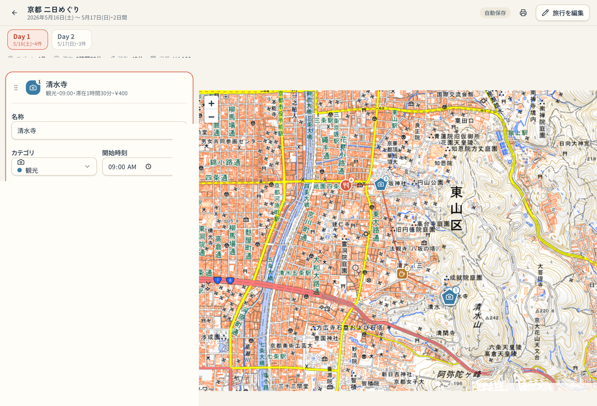

# Tabiori — 国内旅行プランナー

日本国内の日帰り〜数日間の旅行を、**地図と旅程**でまとめて計画できるローカルファーストの Web アプリです。行き先を**地名・施設名で検索**するか地図に置き、日ごとに並べ替え、時間・予算・メモを書き込んで、そのまま印刷や PDF にできます。地名検索・住所の自動補完・隣接スポット間の**ルート計算（徒歩・自動車・自転車の移動時間と距離）**には [Geoapify](https://www.geoapify.com/) を使用します（いずれも任意・明示操作時のみ）。**公共交通は Geoapify では自動計算せず、Google Maps の経路をワンクリックで開いて確認し、移動時間を手入力**します。API キーが無くても、地図クリックでの手動追加・移動時間の手入力・Google Maps での公共交通確認は使えます。

🔗 **公開デモ: <https://iwatas-hub.github.io/tabi-planner/>**

> 仮プロダクト名「**Tabiori**」。名称は [`src/config/app.ts`](src/config/app.ts) の 1 か所で変更できます。

## スクリーンショット

| 旅行一覧                                    | 旅程編集（デスクトップ）                                            |
| ------------------------------------------- | ------------------------------------------------------------------- |
|  |  |

| 旅程編集（モバイル）                                           | 印刷／PDF プレビュー                                  |
| -------------------------------------------------------------- | ----------------------------------------------------- |
|  |  |

## 解決したいこと

旅行の計画は、地図・メモ・スケジュール・予算が別々のアプリに散らばりがちです。Tabiori はそれらを 1 画面にまとめ、**地図にスポットを置く → 日ごとに並べる → 時間と予算を書く**という流れだけで「旅のしおり」ができあがるようにしました。アカウント登録もサーバーも不要で、思い立ったらすぐ書き始められます。

## 主な機能

**旅行一覧**

- 旅行名・日程・日数・スポット数・最終更新日時をカード表示
- 新規作成・複製・削除（削除は確認ダイアログ）
- **JSON での書き出し（バックアップ）／読み込み（インポート）**
- 丁寧に作り込んだ空状態

**旅行の作成・編集**

- 旅行名・開始日・終了日・概要、入力エラー表示
- 日程の変更に合わせて日（Day）を自動生成。期間を縮めても、外れた日のスポットは最終日へ退避

**旅程編集**

- デスクトップは左に旅程（スクロール）＋右に地図（固定）、モバイルは旅程／地図のタブ切替
- **地名・施設検索**（Geoapify）。結果を現在の日に追加して名称・住所・緯度経度を保存し、地図を移動。キーボード操作・Escape での結果クローズに対応
- 地図クリックでスポット追加。Geoapify 利用可能時は**背景で逆ジオコーディング**し、住所と（未編集なら）名称を補完
- 名称・**住所**・カテゴリ・開始時刻・滞在時間・移動時間（手動）・メモ・URL・予算を編集
- **隣接スポット間のルート計算**（Geoapify）。移動手段（徒歩／自動車／自転車）を選んで「計算」すると、移動時間・距離・実際のルート形状を取得（明示操作時のみ呼び出し、自動／手入力を区別して表示）。**公共交通は Geoapify を呼ばず、「Google Mapsで経路を確認」ボタンで外部表示し、移動時間を手入力**します
- スポットの削除・複製、同一日内のドラッグ並べ替え（キーボード操作対応）
- **その日の合計（スポット数・滞在時間・移動時間・予算）をさりげなく表示**
- 選択中スポットの地図上での強調、リスト選択で該当ピンへ移動、全ピン表示
- 変更内容の自動保存（保存中／保存済み／保存失敗を画面に表示）

**地図**

- 国土地理院（地理院タイル）標準地図、出典表示、初期表示は日本全体
- ピンはカテゴリごとに色・形・アイコンで識別（色だけに依存しない）／旅程順を直線で結ぶ

**印刷・PDF**

- 「印刷／PDF」ボタンからブラウザの印刷機能で出力
- 画面用の UI・地図・入力フォームは隠し、旅程だけを A4 縦向けに整形した専用レイアウトで描画
- 旅行名・概要・日程、日ごとの日付とサマリー、スポットの順番・時刻・滞在/移動・カテゴリ・予算・メモ・URL を掲載。白黒印刷でも判別可能

## ローカルファーストとデータの扱い

- データは**この端末・このブラウザの IndexedDB にのみ**保存されます。サーバーには何も送信しません。
- そのため、**別のブラウザ・別の端末・別の URL（origin）には自動同期されません。**
- ブラウザの履歴やサイトデータを消去すると、旅行データも一緒に削除されることがあります。
- 大切な旅程や端末を移したいときは、**旅行ごとに JSON で書き出して保管**してください（一覧カードの「…」→「JSONで書き出し」）。読み込みは一覧の「読み込み」ボタンから行え、**常に新しい旅行として取り込む**ため既存の旅行を上書きしません。

## 技術構成

| 領域           | 採用技術                                                              |
| -------------- | --------------------------------------------------------------------- |
| ビルド / 言語  | Vite 8・React 19・TypeScript 6（`strict`、`any` 禁止）                |
| スタイル       | Tailwind CSS v4・shadcn/ui 準拠の自作プリミティブ                     |
| ルーティング   | React Router（`HashRouter` — GitHub Pages でサーバー設定不要）        |
| 地図           | React Leaflet・Leaflet・**地理院タイル（標準地図）**                  |
| 地名検索       | **Geoapify Geocoding API**（任意。サービス層で抽象化・差し替え可）    |
| ルート計算     | **Geoapify Routing API**（徒歩・自動車・自転車のみ・明示操作時）      |
| 公共交通       | **Google Maps 経路リンク**（外部表示・所要時間は手入力。APIキー不要） |
| 並べ替え       | dnd-kit                                                               |
| 永続化         | Dexie（IndexedDB）＋リポジトリ層                                      |
| バリデーション | Zod（永続データ・フォーム入力・バックアップの検証）                   |
| テスト         | Vitest・React Testing Library・Playwright                             |
| 品質           | ESLint（Flat Config）・Prettier                                       |

### アーキテクチャ（責務分離）

```
src/
  config/          プロダクト名・環境変数（API キー）アクセス
  domain/          UI ドメイン型・カテゴリ・集計（summary）・バックアップ形式（backup）・地名検索型（geocoding）
  validation/      Zod スキーマ（永続化・フォーム・バックアップ検証の単一の真実）
  db/              Dexie 定義・永続化レコード型・レコード⇔ドメインの変換
  repositories/    Trip / Place リポジトリ（React は Dexie を直接触らない）
  services/        外部サービス連携（geocoding / routing：provider 抽象 + Geoapify 実装 + キャッシュ）
  hooks/           リアクティブなデータ取得・保存状態・メディアクエリ
  components/ui/   shadcn 風プリミティブ（Button, Dialog, Select …）
  features/        画面単位（trips / itinerary / map）
  lib/             日付・数値ユーティリティ、ダウンロード補助
```

- DB レコード型（`db/records.ts`）は Zod スキーマから推論し、UI ドメイン型（`domain/types.ts`）とは分離。境界はマッパー（`db/mappers.ts`）に集約。
- React コンポーネントは Dexie を直接操作せず、必ずリポジトリ層を経由します。バックアップの書き出し／取り込みも `tripRepository` の `exportTrip` / `importBackup` 経由で、取り込みは単一トランザクションで処理します。
- 集計（1 日サマリー）は `domain/summary.ts` の純粋関数に分離し、UI から独立してテストできます。
- 地名検索・ルート計算は `services/geocoding` / `services/routing` の provider インターフェース越しに利用し、UI は Geoapify 固有のレスポンスを知りません。`fetch` を注入でき、URL 生成は 1 か所に集約、外部レスポンスは Zod で検証します（provider は後から差し替え可能）。
- ルート計算（徒歩・自動車・自転車）は**明示操作時だけ**呼び出します。結果の time / distance / geometry は検証のうえ、**ルート形状（geometry）は IndexedDB・JSON バックアップへ保存せず**、メモリ（React state とキャッシュ）にのみ保持します。再読み込み後は保存済みの時間・距離だけが残り、地図表示のために API を再取得しません。**公共交通は Geoapify を呼ばず**、Google Maps の経路 URL（[`lib/googleMapsDirections.ts`](src/lib/googleMapsDirections.ts)）を外部タブで開きます。
- `schemaVersion` を各 Trip に保持し、Dexie の `version()` ブロックで将来のマイグレーションに備えています。`Place.address` と Phase 2.2 の移動見積もりフィールド（`travelMode` / `travelDistanceMeters` / `travelEstimateSource` / `travelToPlaceId` / `travelRouteKey` / `travelCalculatedAt`）はいずれも任意（nullish・空値は null 正規化）。**index に使わないため Dexie のスキーマ version は更新せず**、これらを持たない旧レコード・旧バックアップも読み込めます（**JSON バックアップは version 1 を維持**）。

## ローカル起動

前提: Node.js 20 以上（開発は Node 24 で確認）。

```bash
npm ci             # 依存をインストール（package-lock.json を固定）
npm run dev        # 開発サーバー（http://localhost:5173）
npm run build      # 本番ビルド（dist/ を生成）
npm run preview    # ビルド成果物をローカルでプレビュー
```

## 地名・施設検索と住所補完（Geoapify）

旅程編集画面で**地名・施設を検索**して現在選択中の日に追加でき、**地図クリックで追加したスポットには住所が自動補完**されます。いずれも [Geoapify Geocoding API](https://www.geoapify.com/)（Forward / Reverse Geocoding）を使用します。

- 検索は日本国内に限定し、結果は日本語を優先、最大 5 件です。
- 入力中の自動検索（オートコンプリート）は行いません。検索ボタンまたは Enter で実行します。
- 連打抑止・前リクエストの中止（AbortController）・タイムアウト・同一条件のメモリキャッシュにより、外部 API の消費を抑えます。
- **API キーが未設定でもアプリは起動します。** その場合、検索欄には「検索機能の設定がありません」と表示され検索は無効ですが、**地図クリックによる手動追加はそのまま使えます**（住所の自動補完のみ無効）。

### API キーの取得とローカル設定

1. [Geoapify](https://www.geoapify.com/) で無料アカウントを作成し、API キーを発行します。**無料枠や利用制限は提供元の規約により変わり得る**ため、利用前に最新の内容（上限・商用利用条件など）を必ず確認してください。
2. リポジトリ直下の [`.env.example`](.env.example) を `.env.local` にコピーし、キーを設定します。`.env.local` は `.gitignore` 済みで、コミットされません。

```bash
# .env.local
VITE_GEOAPIFY_API_KEY=your-geoapify-api-key
```

3. `npm run dev` を再起動すると検索が有効になります。

### 公開ビルド（GitHub Actions / Pages）

GitHub Actions の Build ステップは、リポジトリの **Secret `GEOAPIFY_API_KEY`** を `VITE_GEOAPIFY_API_KEY` として読み込みます（[`deploy.yml`](.github/workflows/deploy.yml)）。Secret が未設定でもビルド・デプロイは成功し、Geoapify 連携（検索・住所補完・ルート計算）のみ無効になります。

> **キーの取り扱いに関する注意**
>
> - フロントエンドのビルドに埋め込まれたキーは、配信される JS バンドルから**完全には隠せません**。公開ビルドでは Geoapify ダッシュボードで**許可 Origin（ドメイン）を制限したキー**を使用してください。
> - 実際のキー値は、コード・テスト・README・スクリーンショット・コミット履歴に**含めない**でください。

### プライバシー

- 入力した**検索語は Geoapify に送信されます**。氏名・住所・予約番号などの個人情報や機密情報は検索に入力しないでください。
- 検索語を独自サーバーへ保存することはありません。**検索履歴は永続化せず**、結果のメモリキャッシュもタブを閉じれば消えます（永続 DB には API レスポンス全体を保存しません）。
- アナリティクスやトラッキングは追加していません。
- 出典表示として、検索 UI 付近に **Powered by Geoapify** を明記しています（地図の地理院タイル出典とは別に表示）。

## ルート計算と移動時間の見積もり

同じ日の隣接するスポット間で、移動時間と距離を見積もれます。**徒歩・自動車・自転車**は [Geoapify Routing API](https://www.geoapify.com/)（検索・逆ジオコーディングと**同じ API キー**）で計算し、**公共交通は Google Maps の経路を開いて確認**します。

### 徒歩・自動車・自転車（Geoapify）

- **ユーザーが「計算」／「再計算」を押したときだけ** API を呼びます。スポット追加・並べ替え・画面表示で自動的には呼びません。
- **1 区間ごとに 1 リクエスト**を消費し、これも Geoapify の利用枠を消費します。同じ区間・同じモードの再計算はメモリキャッシュで節約します（タブを閉じると消えます）。
- 計算結果（時間・距離・モード）はスポットに保存され、再読み込み後も残ります。**ルート形状（geometry）は永続化せず**、再読み込み後は地図上の実ルート表示は消えて旅程順の直線表示に戻ります（地図表示のために API を再取得しません）。
- 結果はあくまで**推定値**で、実際の交通状況・規制・運行状況により異なる場合があります。
- リクエストは 1 区間 = 2 地点のみで、advanced details・elevation・avoid・最適化は要求しません。出典は **Powered by Geoapify** を表示します。

### 公共交通（Google Maps）

- 公共交通は **Geoapify では自動計算しません**（対象地域では `approximated_transit` の経路データが実用にならないため、利用していません）。
- 移動手段で「公共交通」を選ぶと「**Google Mapsで経路を確認**」ボタンが表示され、出発地・到着地の緯度経度を渡して Google Maps の公共交通経路（`travelmode=transit`）を新しいタブで開きます。**API キーは不要**で、URL に Geoapify の情報や API キーは含めません。
- **時刻・運賃・乗換経路は Google Maps 側の表示に従います。** 所要時間は各スポットの編集欄から**手入力**してください（手入力時間は 1 日サマリーと印刷に反映されます）。
- 外部サービス（Google Maps）には**出発地・到着地の座標が渡ります**。

### API キーが未設定のとき

- アプリは動作します。徒歩・自動車・自転車の自動計算は無効になりますが、各スポットの編集で**移動時間を手入力**でき、公共交通の **Google Maps 確認も利用できます**（Google Maps URL に API キーは不要）。自動計算した時間と手入力の時間は画面上で「自動／手入力」と区別して表示します。

## テスト

```bash
npm run typecheck  # 型チェック（tsc）
npm run lint       # ESLint
npm run test       # 単体・結合テスト（Vitest）
npm run test:e2e   # E2E（Playwright。初回は下記のブラウザ取得が必要）

npx playwright install chromium
```

テストでカバーしている主な対象:

- 日付・集計ユーティリティ（1 日サマリーの合計、0 件・0 分・0 円）
- Zod による検証（フォーム入力、保存データ、バックアップ全体）
- リポジトリ（日の自動生成、スポットの追加・編集・削除、並べ替え後の order、再読み込み相当でのデータ復元）
- バックアップのラウンドトリップ（書き出し→取り込みで全 ID が再生成され、TripDay と Place の参照が正しく張り替わる／未対応 version・不正 JSON・不正データ・サイズ超過の拒否／取り込み途中失敗で部分保存が起きないこと）
- バックアップと住所の互換性（`address` の無い旧 version 1 バックアップを読み込める／新しい書き出しには `address` を含む／空白住所の null 正規化）
- 地名検索クライアント（レスポンス変換・日本/日本語指定・401/403/429/5xx・timeout・abort・不正 lat/lon・キャッシュのヒット/期限切れ）。**実 API は呼びません**
- ルート計算クライアント（徒歩・自動車・自転車。time/distance/geometry 変換・lang=ja・waypoints は 2 地点・空 route/不正座標の拒否・401/403/429/5xx・timeout/abort/network・キャッシュ）。**実 API は呼びません**
- 公共交通は Geoapify を呼ばず Google Maps URL を生成（api=1・travelmode=transit・出発/到着座標・API キー非混入・不正座標で URL を作らない）
- ルート結果の保存・分の切り上げ・手入力で自動メタデータを解除・並べ替え/削除/複製での自動値の無効化・古い結果を保存しない・`travelToPlaceId` のインポート時 ID 張り替え・geometry を書き出さない
- スポットの住所の保存／復元、逆ジオコーディングの補完規則（未編集の名称のみ補完、編集済みは上書きしない）
- インポート UI（成功時に旅行が追加され、失敗時はダイアログで理由を表示）／検索 UI（短い語で API を呼ばない・結果選択で追加・エラー表示・キー未設定でも動作）
- E2E（旅行作成→地図でスポット追加→再読み込みで復元、書き出し→取り込み→開く→印刷ビュー、地名検索→結果選択→追加→住所保存→再読み込み復元、地図クリック後の逆ジオコーディング、API 失敗時も手動追加が残る。Playwright route で Geoapify を mock）

## GitHub Pages への公開

`vite.config.ts` は `base: './'`（相対パス）＋ `HashRouter` 構成のため、リポジトリ名に依存せずサブパス配信でそのまま動きます。サーバー側のリライト設定も不要です。

公開は [`.github/workflows/deploy.yml`](.github/workflows/deploy.yml) の GitHub Actions が担います。`main` ブランチへの push、または Actions 画面からの手動実行（`workflow_dispatch`）で、`npm ci` → `npm run build` → `dist/` を Pages アーティファクトとしてアップロード → デプロイ、という流れが走ります（Node 24、`actions/configure-pages` / `upload-pages-artifact` / `deploy-pages` を使用）。

初回のみ、リポジトリの **Settings → Pages → Source** を「GitHub Actions」に設定してください。

## ロードマップ

完了（Phase 1 / 1.2 / 2.1 / 2.2）:

- [x] 旅行一覧・作成・編集、旅程編集、地図連携、ローカル保存（Phase 1）
- [x] 1 日サマリー（スポット数・滞在・移動・予算の合計）（Phase 1.2）
- [x] 旅行単位の JSON エクスポート／インポート（Phase 1.2）
- [x] 印刷・PDF 向けの旅程レイアウト（Phase 1.2）
- [x] 地名・施設の検索／逆ジオコーディング（Geoapify。利用ポリシー順守）（Phase 2.1）
- [x] 道路ルート計算による移動時間の自動見積もり（Geoapify。明示操作時のみ）（Phase 2.2）

次の候補:

- [ ] 天気情報の表示
- [ ] PWA 化（オフライン対応・ホーム画面追加）
- [ ] 日をまたぐスポット移動、複数端末同期、ダークモード

## 外部サービスの出典

- 地図タイル: **国土地理院（地理院タイル）** — <https://maps.gsi.go.jp/development/ichiran.html>
- 地図表示ライブラリ: Leaflet / React Leaflet
- 地名・施設検索／逆ジオコーディング／ルート計算（徒歩・自動車・自転車）: **Geoapify** — <https://www.geoapify.com/>
- 公共交通の経路確認: **Google Maps**（外部リンク。所要時間は手入力）

地理院タイルの利用にあたっては、各タイルの利用規約・出典表示の条件に従ってください（アプリ内の地図にも出典を常時表示しています）。Geoapify の出典（Powered by Geoapify）は検索・ルート計算 UI 付近に表示しています。利用規約・無料枠（将来変更され得ます）は提供元の最新の内容に従ってください。

## 補足

- 旧 CDN 版プロトタイプ「旅のしおり」は [`legacy/`](legacy/) に保管しています（本アプリの実装には未使用）。
